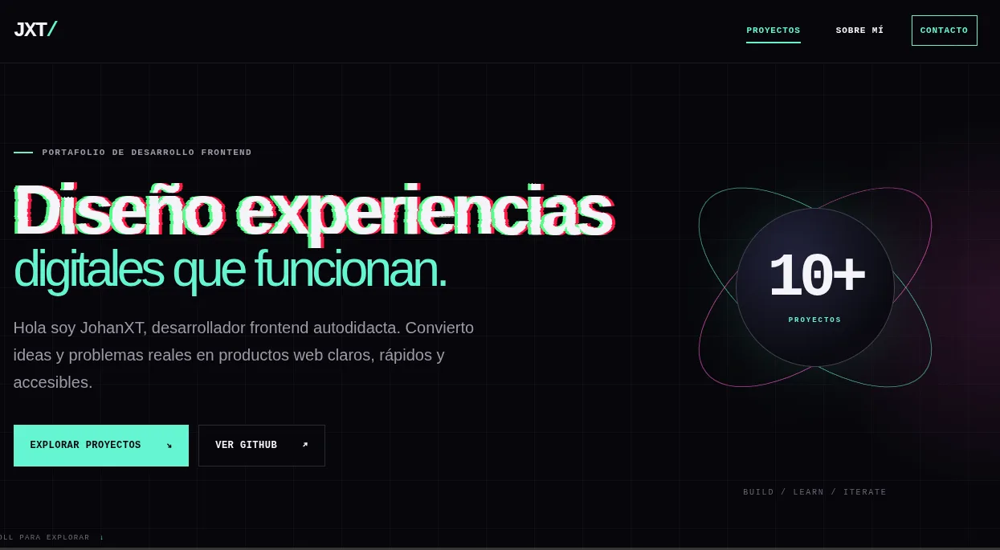

# JohanXT — Portafolio de proyectos independientes

Portafolio personal creado para presentar una colección en crecimiento de proyectos frontend independientes.

La página reúne proyectos terminados, productos en desarrollo y futuras soluciones, documentando mi evolución como desarrollador frontend autodidacta.



## Demo

La versión publicada se agregará aquí al finalizar el sprint de despliegue.

## Características

- Diseño cyberpunk minimalista.
- Arquitectura mobile first.
- Colección preparada para diez o más proyectos.
- Tarjetas generadas dinámicamente con JavaScript.
- Dashboard profesional en la sección “Sobre mí”.
- Indicador automático de proyectos terminados.
- Navegación móvil accesible.
- Navegación activa mediante `IntersectionObserver`.
- Animaciones de entrada progresivas.
- Efectos SVG glitch y single slashed.
- Compatibilidad con movimiento reducido.
- Imágenes optimizadas en formato WebP.
- SEO y metadatos sociales.
- Diseño responsive para móvil, tablet y desktop.

## Tecnologías

- HTML5
- Sass
- CSS3
- JavaScript
- ES Modules
- SVG
- Git
- GitHub Pages

## Estructura

```text
.
├── assets/
│   ├── icons/
│   │   └── technologies/
│   └── images/
├── css/
│   └── styles.css
├── docs/
│   └── CHANGELOG.md
├── js/
│   ├── app.js
│   └── projects.js
├── scss/
│   └── styles.scss
├── .gitignore
├── index.html
├── LICENSE
├── package.json
├── package-lock.json
└── README.md
```

## Instalación

Clona el repositorio:

```bash
git clone https://github.com/YovaniDosh/C.o.d.e.x.git
```

Entra al proyecto:

```bash
cd C.o.d.e.x
```

Instala las dependencias:

```bash
npm install
```

Inicia el observador de Sass:

```bash
npm run sass:watch
```

Abre `index.html` con Live Server.

## Scripts

Modo desarrollo:

```bash
npm run sass:watch
```

Compilación comprimida para producción:

```bash
npm run sass:build
```

## Gestión de proyectos

La información de las tarjetas se administra desde:

```text
js/projects.js
```

Para registrar un nuevo proyecto se agrega un objeto al arreglo `projects`:

```js
{
    id: "nombre-del-proyecto",
    number: "02",
    title: "Nombre del proyecto",
    description:
        "Descripción breve del proyecto.",
    technologies: [
        "HTML",
        "Sass",
        "JavaScript"
    ],
    status:
        PROJECT_STATUS.PLANNED,
    featured: false,
    repositoryUrl: null,
    demoUrl: null
}
```

El dashboard calcula automáticamente los proyectos terminados usando:

```js
PROJECT_STATUS.COMPLETED
```

## Accesibilidad

El proyecto incluye:

- Enlace para saltar al contenido.
- Navegación mediante teclado.
- Indicadores de foco visibles.
- Textos alternativos.
- Etiquetas ARIA donde aportan contexto.
- SVG decorativos ocultos para lectores de pantalla.
- Títulos SVG con alternativa textual.
- Compatibilidad con `prefers-reduced-motion`.
- Áreas táctiles apropiadas.

## Metodología

El proyecto fue construido progresivamente:

1. Estructura semántica.
2. Sistema visual cyberpunk.
3. Tarjetas dinámicas.
4. Diseño responsive.
5. Sección “Sobre mí”.
6. Dashboard profesional.
7. Animaciones y efectos SVG.
8. Refactorización.
9. Rendimiento y SEO.
10. Accesibilidad.
11. Documentación y publicación.


## Autor

**JohanXT**

- GitHub: [YovaniDosh](https://github.com/YovaniDosh)
- Perfil: desarrollador frontend autodidacta

## Licencia

Este proyecto está disponible bajo la licencia [MIT](./LICENSE).